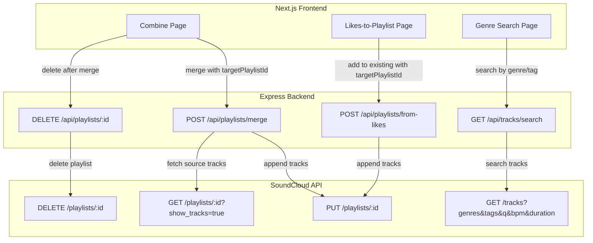
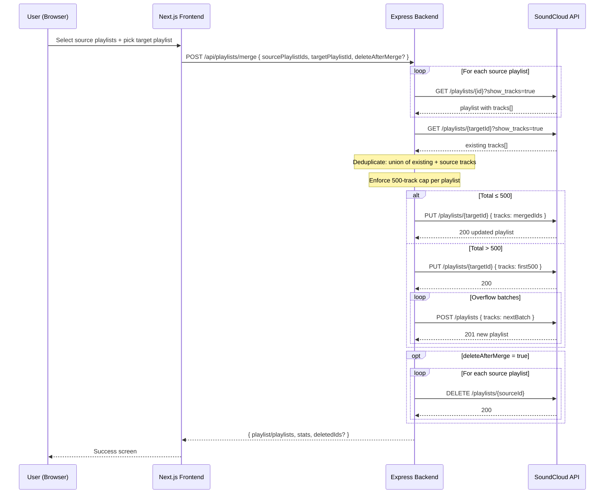
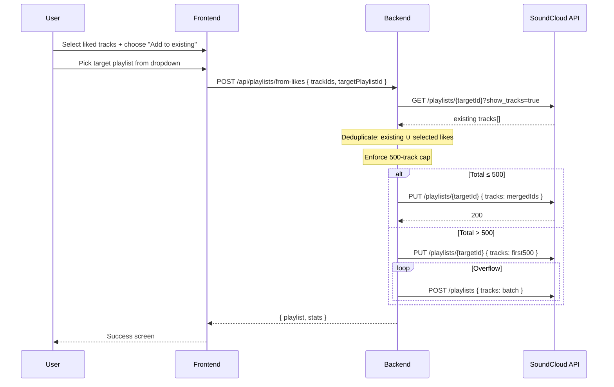
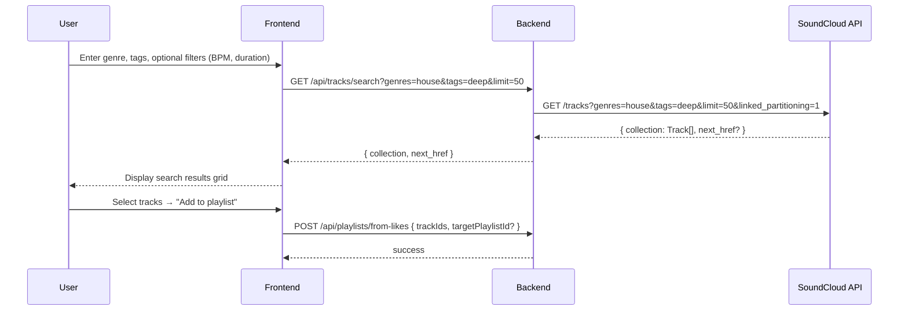

# Design Document: Playlist Enhancements

## Overview

This feature set adds four enhancements to the SoundCloud Toolkit's playlist management capabilities:

1. **Merge into existing playlist** — The current merge endpoint (`POST /api/playlists/merge`) always creates a new playlist. This enhancement adds the option to merge source playlists into an existing user-owned playlist, appending deduplicated tracks to it via `PUT /playlists/{id}`.

2. **Delete source playlists after merge** — An opt-in option (with confirmation) to delete the original source playlists after a successful merge, using `DELETE /playlists/{id}` for each source.

3. **Add likes to existing playlist** — The current from-likes endpoint (`POST /api/playlists/from-likes`) always creates a new playlist. This enhancement adds the option to append selected liked tracks to an existing playlist instead.

4. **Genre/tag search** — A new tool that lets users search SoundCloud's track catalog by genre and tag filters using `GET /tracks?genres=...&tags=...`, without needing to find a track with that tag first. Results can then be added to a playlist.

## Architecture



## Sequence Diagrams

### Merge into Existing Playlist



### Add Likes to Existing Playlist



### Genre/Tag Search



## Components and Interfaces

### Component 1: Merge Endpoint Enhancement (Backend)

**Purpose**: Extend `POST /api/playlists/merge` to support merging into an existing playlist and optionally deleting sources.

**Interface**:
```typescript
// Extended merge request body
interface MergePlaylistsRequest {
  sourcePlaylistIds: number[];
  title?: string;                  // Required only when targetPlaylistId is absent
  targetPlaylistId?: number;       // NEW: if set, merge INTO this playlist
  deleteAfterMerge?: boolean;      // NEW: opt-in source deletion
}

// Extended merge response
interface MergePlaylistsResponse {
  playlist?: SCPlaylist;           // Single result (≤500 tracks)
  playlists?: SCPlaylist[];        // Multiple results (>500 tracks, split)
  stats: MergeStats;
  deletedPlaylistIds?: number[];   // IDs of successfully deleted source playlists
  deleteErrors?: Array<{ id: number; error: string }>;
}

interface MergeStats {
  sourcePlaylists: number;
  fetchedTotal: number;
  acceptedTotal: number;
  uniqueBeforeCap: number;
  totalTracks: number;
  existingTrackCount?: number;     // Tracks already in target before merge
  addedCount?: number;             // Net new tracks added
  finalCount: number;
  numPlaylistsCreated?: number;
}
```

**Responsibilities**:
- Fetch target playlist tracks when `targetPlaylistId` is provided
- Deduplicate across source + existing target tracks
- Append via `PUT /playlists/{targetId}` in 100-track batches
- Handle overflow (>500 total) by filling target to 500, then creating new playlists for the rest
- Delete source playlists when `deleteAfterMerge` is true, only after successful merge
- Never delete the target playlist even if it appears in sourcePlaylistIds

### Component 2: Delete Playlist Endpoint (Backend)

**Purpose**: New endpoint to delete a user's playlist via the SoundCloud API.

**Interface**:
```typescript
// DELETE /api/playlists/:id
// Response: { ok: true } or { error: string }
```

**Responsibilities**:
- Validate playlist ID
- Call `DELETE /playlists/{id}` on SoundCloud API
- Return success/failure
- Log operation

### Component 3: From-Likes Enhancement (Backend)

**Purpose**: Extend `POST /api/playlists/from-likes` to support adding tracks to an existing playlist.

**Interface**:
```typescript
interface FromLikesRequest {
  trackIds: number[];
  title?: string;                  // Required only when targetPlaylistId is absent
  targetPlaylistId?: number;       // NEW: if set, add to this playlist
}

interface FromLikesResponse {
  playlist?: { id: number; title: string; permalink_url: string };
  playlists?: Array<{ id: number; title: string; permalink_url: string; trackCount: number }>;
  totalTracks: number;
  addedCount?: number;             // Net new tracks (after dedup)
  numPlaylistsCreated?: number;
}
```

**Responsibilities**:
- When `targetPlaylistId` is provided, fetch existing tracks, deduplicate, and append
- Handle 500-track overflow same as merge
- When `targetPlaylistId` is absent, behave exactly as current (create new)

### Component 4: Track Search Endpoint (Backend)

**Purpose**: New endpoint to search SoundCloud tracks by genre, tags, and other filters.

**Interface**:
```typescript
// GET /api/tracks/search
interface TrackSearchQuery {
  genres?: string;      // Comma-separated genre slugs (e.g., "house,techno")
  tags?: string;        // Comma-separated tags
  q?: string;           // Free-text query
  bpm_from?: number;
  bpm_to?: number;
  duration_from?: number;  // In milliseconds
  duration_to?: number;
  created_at_from?: string; // ISO date
  created_at_to?: string;
  limit?: number;       // Default 50, max 200
  offset?: number;
  linked_partitioning?: boolean;
}

interface TrackSearchResponse {
  collection: SCTrack[];
  next_href?: string;
  total_results?: number;
}
```

**Responsibilities**:
- Proxy search to `GET /tracks` on SoundCloud API with appropriate filters
- Normalize track results using existing `normalizeResource`
- Support pagination via `linked_partitioning`

### Component 5: SoundCloudClient Extension

**Purpose**: Add `deletePlaylist` and `searchTracks` methods to the existing client.

**Interface**:
```typescript
// New methods on SoundCloudClient
class SoundCloudClient {
  // ... existing methods ...

  async deletePlaylist(
    accessToken: string, refreshToken: string, playlistId: number
  ): Promise<void>;

  async searchTracks(
    accessToken: string, refreshToken: string, params: TrackSearchQuery
  ): Promise<{ collection: any[]; next_href?: string }>;
}
```

### Component 6: Combine Page Enhancement (Frontend)

**Purpose**: Add "Merge into existing" toggle and "Delete sources after merge" checkbox to the Combine Playlists page.

**Responsibilities**:
- Add a toggle: "Create new playlist" vs "Add to existing playlist"
- When "Add to existing" is selected, show a playlist picker dropdown (excluding selected source playlists)
- Add a "Delete source playlists after merge" checkbox (disabled by default)
- When delete is checked and user clicks Merge, show a confirmation dialog listing playlists to be deleted
- Update success screen to show deleted playlists info

### Component 7: Likes-to-Playlist Page Enhancement (Frontend)

**Purpose**: Add "Add to existing playlist" option to the Likes → Playlist page.

**Responsibilities**:
- Add a toggle: "Create new playlist" vs "Add to existing playlist"
- When "Add to existing" is selected, show a playlist picker dropdown
- Hide the "Playlist Name" input when adding to existing
- Update the API call to include `targetPlaylistId`

### Component 8: Genre Search Page (Frontend)

**Purpose**: New page at `/genre-search` for searching tracks by genre/tag.

**Responsibilities**:
- Genre input with common genre suggestions (house, techno, ambient, etc.)
- Tags input (free-form, comma-separated)
- Optional advanced filters: BPM range, duration range
- Results grid with track cards (artwork, title, artist, duration)
- Track selection with "Add to playlist" action (create new or add to existing)
- Pagination ("Load more" button using `next_href`)

## Data Models

### Existing Models (No Changes)

The Prisma schema (`User`, `Token`, `OperationLog`) requires no changes. The `OperationLog.action` field already supports free-form strings, so new actions like `'genre-search'`, `'delete-playlist'` will work without migration.

### SoundCloud Track (from API)

```typescript
interface SCTrack {
  id: number;
  title: string;
  user: { id: number; username: string };
  artwork_url: string | null;
  duration: number;           // milliseconds
  genre: string | null;
  tag_list: string | null;
  permalink_url: string;
  playback_count: number;
  likes_count: number;
  created_at: string;
  downloadable: boolean;
  streamable: boolean;
}
```

### Validation Rules

- `sourcePlaylistIds`: non-empty array of positive integers, max 20
- `targetPlaylistId`: positive integer, must not appear in `sourcePlaylistIds` (for merge)
- `deleteAfterMerge`: boolean, defaults to `false`
- `trackIds` (from-likes): non-empty array of positive integers, max 5000
- `genres`: string, max 200 chars, comma-separated alphanumeric slugs
- `tags`: string, max 200 chars
- `bpm_from`/`bpm_to`: integers 1–300
- `limit`: integer 1–200

## Key Functions with Formal Specifications

### Function 1: mergeIntoExistingPlaylist()

```typescript
async function mergeIntoExistingPlaylist(
  accessToken: string,
  refreshToken: string,
  sourcePlaylistIds: number[],
  targetPlaylistId: number,
  deleteAfterMerge: boolean
): Promise<MergePlaylistsResponse>
```

**Preconditions:**
- `accessToken` and `refreshToken` are valid, non-empty strings
- `sourcePlaylistIds` is a non-empty array of positive integers (1–20 items)
- `targetPlaylistId` is a positive integer
- `targetPlaylistId ∉ sourcePlaylistIds`
- User owns the target playlist and all source playlists

**Postconditions:**
- Target playlist contains the union of its original tracks and all source playlist tracks (deduplicated by track ID)
- If union size > 500: target playlist filled to 500, overflow placed in new numbered playlists
- `stats.addedCount` = (final total unique tracks) - (original target track count)
- If `deleteAfterMerge` is true: each source playlist in `sourcePlaylistIds` has been deleted via SC API
- `deletedPlaylistIds` contains IDs of successfully deleted playlists
- `deleteErrors` contains IDs of playlists that failed to delete (partial failure is acceptable)
- No tracks are lost — every unique track from sources appears in exactly one output playlist
- Operation is logged to `OperationLog`

**Loop Invariants:**
- During source fetching: `trackIdSet` contains all unique track IDs seen so far across processed sources
- During batch PUT: all tracks from index 0 to current batch end are present in the target playlist
- During source deletion: `deletedPlaylistIds.length + deleteErrors.length ≤ sourcePlaylistIds.length`


### Function 2: appendTracksToExistingPlaylist()

```typescript
async function appendTracksToExistingPlaylist(
  accessToken: string,
  refreshToken: string,
  targetPlaylistId: number,
  newTrackIds: number[]
): Promise<{ addedCount: number; finalCount: number; overflow: SCPlaylist[] }>
```

**Preconditions:**
- `targetPlaylistId` is a valid playlist owned by the authenticated user
- `newTrackIds` is a non-empty array of positive integers
- All track IDs reference existing, streamable tracks on SoundCloud

**Postconditions:**
- Target playlist contains `min(existingUnique ∪ newTrackIds, 500)` tracks
- If `|existingUnique ∪ newTrackIds| > 500`: overflow tracks placed in new playlists (≤500 each)
- `addedCount` = `|existingUnique ∪ newTrackIds| - |existingUnique|`
- `finalCount` = total tracks across target + overflow playlists
- Original track order in target playlist is preserved; new tracks appended after existing

**Loop Invariants:**
- During batch PUT: cumulative tracks sent = `existingIds.concat(newUniqueIds.slice(0, batchEnd))`
- Each overflow playlist contains exactly `min(500, remaining)` tracks

### Function 3: deletePlaylistsAfterMerge()

```typescript
async function deletePlaylistsAfterMerge(
  accessToken: string,
  refreshToken: string,
  playlistIds: number[]
): Promise<{ deletedIds: number[]; errors: Array<{ id: number; error: string }> }>
```

**Preconditions:**
- `playlistIds` is a non-empty array of positive integers
- User owns all playlists in the array
- Merge operation has completed successfully before this function is called

**Postconditions:**
- For each ID in `playlistIds`: either it appears in `deletedIds` (successfully deleted) or in `errors`
- `deletedIds.length + errors.length === playlistIds.length`
- Deletion failures do not throw — they are collected in `errors`
- Each deletion is attempted sequentially with a 300ms delay to respect rate limits

**Loop Invariants:**
- `deletedIds.length + errors.length === index` (where index is current iteration)

### Function 4: searchTracks()

```typescript
async function searchTracks(
  accessToken: string,
  refreshToken: string,
  params: TrackSearchQuery
): Promise<TrackSearchResponse>
```

**Preconditions:**
- At least one of `genres`, `tags`, or `q` is non-empty
- `limit` is between 1 and 200 (default 50)
- `bpm_from ≤ bpm_to` if both are provided
- `duration_from ≤ duration_to` if both are provided

**Postconditions:**
- `collection` contains at most `limit` tracks
- Each track in `collection` matches the provided genre/tag/query filters
- `next_href` is present if more results are available
- Results are normalized using `normalizeResource`

**Loop Invariants:** N/A (single API call, no loops)

## Algorithmic Pseudocode

### Merge into Existing Playlist Algorithm

```typescript
// POST /api/playlists/merge handler (extended)
async function handleMerge(req, res) {
  const { sourcePlaylistIds, title, targetPlaylistId, deleteAfterMerge } = req.body;

  // Step 1: Collect all unique track IDs from sources
  const trackIdSet = new Set<number>();
  for (const sourceId of sourcePlaylistIds) {
    const playlist = await sc.getPlaylistWithTracks(token, refresh, sourceId);
    const validTracks = playlist.tracks.filter(t => t && !t.blocked_at && t.streamable !== false);
    for (const t of validTracks) trackIdSet.add(t.id);
    await sleep(300);
  }

  if (targetPlaylistId) {
    // Step 2a: Merge INTO existing playlist
    const target = await sc.getPlaylistWithTracks(token, refresh, targetPlaylistId);
    const existingIds = target.tracks.map(t => t.id);
    const existingSet = new Set(existingIds);
    const existingCount = existingIds.length;

    // Deduplicate: only add tracks not already in target
    const newUniqueIds = [...trackIdSet].filter(id => !existingSet.has(id));
    const mergedIds = [...existingIds, ...newUniqueIds];

    // Step 3: Apply to target (with 500-track cap + overflow)
    const result = await appendTracksToExistingPlaylist(
      token, refresh, targetPlaylistId, mergedIds
    );

    // Step 4: Optionally delete sources
    let deletedInfo = undefined;
    if (deleteAfterMerge) {
      // Never delete the target playlist
      const toDelete = sourcePlaylistIds.filter(id => id !== targetPlaylistId);
      deletedInfo = await deletePlaylistsAfterMerge(token, refresh, toDelete);
    }

    return res.json({ playlist: result.target, stats: { ... }, ...deletedInfo });
  } else {
    // Step 2b: Original behavior — create new playlist
    // ... existing code unchanged ...
  }
}
```

### Append Tracks with Overflow Algorithm

```typescript
async function appendTracksToExistingPlaylist(token, refresh, targetId, allTrackIds) {
  const MAX = 500;
  const BATCH = 100;
  const overflow = [];

  // Fill target playlist up to 500
  const targetBatch = allTrackIds.slice(0, MAX);
  
  // PUT in 100-track incremental batches (SC API requirement)
  for (let i = 0; i < targetBatch.length; i += BATCH) {
    const slice = targetBatch.slice(0, i + BATCH);
    await sc.addTracksToPlaylist(token, refresh, targetId, slice);
    await sleep(300);
  }

  // Create overflow playlists for remaining tracks
  const remaining = allTrackIds.slice(MAX);
  if (remaining.length > 0) {
    const numOverflow = Math.ceil(remaining.length / MAX);
    for (let i = 0; i < numOverflow; i++) {
      const chunk = remaining.slice(i * MAX, (i + 1) * MAX);
      const title = `${targetPlaylistTitle} (overflow ${i + 1})`;
      const newPl = await createPlaylistFromTrackIds(token, refresh, chunk, title, '...');
      overflow.push(newPl);
      await sleep(500);
    }
  }

  return { addedCount: allTrackIds.length - existingCount, finalCount: allTrackIds.length, overflow };
}
```

### Genre/Tag Search Algorithm

```typescript
// GET /api/tracks/search handler
async function handleTrackSearch(req, res) {
  const { genres, tags, q, bpm_from, bpm_to, duration_from, duration_to, limit = 50, offset = 0 } = req.query;

  // Build SC API query params
  const params = new URLSearchParams();
  if (genres) params.set('genres', genres);
  if (tags) params.set('tags', tags);
  if (q) params.set('q', q);
  if (bpm_from || bpm_to) {
    const bpm = {};
    if (bpm_from) bpm.from = bpm_from;
    if (bpm_to) bpm.to = bpm_to;
    params.set('bpm[from]', bpm_from || '');
    params.set('bpm[to]', bpm_to || '');
  }
  if (duration_from) params.set('duration[from]', duration_from);
  if (duration_to) params.set('duration[to]', duration_to);
  params.set('limit', String(Math.min(Number(limit), 200)));
  params.set('offset', String(offset));
  params.set('linked_partitioning', '1');

  const data = await sc.scRequest(`/tracks?${params}`, token, refresh);

  // Normalize results
  const collection = (data.collection || []).map(normalizeResource).filter(Boolean);

  res.json({ collection, next_href: data.next_href || null, total_results: data.total_results });
}
```

## Example Usage

### Merge into Existing Playlist (Frontend)

```typescript
// In Combine page — user selects "Add to existing" mode
const handleMerge = async () => {
  const body: any = {
    sourcePlaylistIds: selectedPlaylists.map(p => p.id),
  };

  if (mergeMode === 'existing') {
    body.targetPlaylistId = targetPlaylist.id;
    body.deleteAfterMerge = deleteAfterMerge;
  } else {
    body.title = newPlaylistTitle;
  }

  const res = await apiFetch('/api/playlists/merge', {
    method: 'POST',
    headers: { 'Content-Type': 'application/json' },
    body: JSON.stringify(body),
  });

  const data = await res.json();
  if (res.ok) {
    setResult(data);
    setIsComplete(true);
  }
};
```

### Add Likes to Existing Playlist (Frontend)

```typescript
// In Likes-to-Playlist page — user picks existing playlist
const addToExisting = async () => {
  const res = await apiFetch('/api/playlists/from-likes', {
    method: 'POST',
    headers: { 'Content-Type': 'application/json' },
    body: JSON.stringify({
      trackIds: Array.from(selectedTracks),
      targetPlaylistId: targetPlaylist.id,
    }),
  });
  const data = await res.json();
  if (res.ok) setResult(data);
};
```

### Genre Search (Frontend)

```typescript
// In Genre Search page
const searchByGenre = async () => {
  const params = new URLSearchParams();
  if (genre) params.set('genres', genre);
  if (tags) params.set('tags', tags);
  if (bpmMin) params.set('bpm_from', bpmMin);
  if (bpmMax) params.set('bpm_to', bpmMax);
  params.set('limit', '50');

  const res = await apiFetch(`/api/tracks/search?${params}`);
  const data = await res.json();
  setResults(data.collection);
  setNextHref(data.next_href);
};
```

## Correctness Properties

*A property is a characteristic or behavior that should hold true across all valid executions of a system — essentially, a formal statement about what the system should do. Properties serve as the bridge between human-readable specifications and machine-verifiable correctness guarantees.*

### Property 1: Deduplication correctness

*For any* set of existing track IDs in a target playlist and any set of source track IDs, merging them SHALL produce an output whose size equals the size of the set union of existing and source IDs, with each track ID appearing exactly once.

**Validates: Requirements 1.1, 4.1**

### Property 2: Order preservation

*For any* target playlist with existing tracks and any set of new tracks to append, the first N elements of the merged result (where N is the original target track count) SHALL equal the original target track list in the same order.

**Validates: Requirement 1.3**

### Property 3: 500-track splitting

*For any* total number of deduplicated tracks N, splitting into playlists SHALL produce exactly `ceil(N / 500)` playlists, each containing at most 500 tracks, and the sum of tracks across all playlists SHALL equal N.

**Validates: Requirements 1.4, 4.3**

### Property 4: Stats consistency

*For any* merge or append operation with an existing target playlist, the returned `addedCount` SHALL equal `finalCount - existingTrackCount`, and `finalCount` SHALL equal the size of the set union of existing and new track IDs.

**Validates: Requirements 1.5, 4.4**

### Property 5: Idempotent append

*For any* target playlist and any set of track IDs that are all already present in the target, appending those tracks SHALL result in `addedCount` of 0 and the target playlist SHALL remain unchanged.

**Validates: Requirement 4.5**

### Property 6: Range parameter validation

*For any* pair of numeric range parameters (bpm_from/bpm_to or duration_from/duration_to), the Search_Endpoint SHALL accept the request when `from <= to` and both values are within valid bounds (1–300 for BPM), and SHALL reject with 400 when `from > to` or values are out of bounds.

**Validates: Requirements 5.3, 5.4, 7.5**

### Property 7: Limit clamping

*For any* integer value provided as `limit`, the Search_Endpoint SHALL clamp it to `min(limit, 200)` and use a default of 50 when not specified, and SHALL reject values less than 1 with a 400 status code.

**Validates: Requirements 5.5, 7.6**

### Property 8: Array ID validation

*For any* array of IDs submitted as `sourcePlaylistIds` or `trackIds`, the endpoint SHALL accept the request only when the array is non-empty, contains only positive integers, and does not exceed the maximum length (20 for sourcePlaylistIds, 5000 for trackIds), rejecting all other inputs with a 400 status code.

**Validates: Requirements 7.1, 7.3**

### Property 9: String length validation

*For any* string provided as `genres` or `tags` to the Search_Endpoint, the endpoint SHALL accept strings of at most 200 characters and reject longer strings with a 400 status code.

**Validates: Requirement 7.4**

## Error Handling

### Error Scenario 1: Target Playlist Not Found

**Condition**: `targetPlaylistId` references a playlist that doesn't exist or isn't owned by the user
**Response**: 404 `{ error: "Target playlist not found or not owned by you" }`
**Recovery**: User selects a different target playlist

### Error Scenario 2: Source Playlist Fetch Failure

**Condition**: One of the source playlists returns 404 or 403 from SoundCloud API
**Response**: 404 `{ error: "Source playlist {id} not found or inaccessible" }`
**Recovery**: User removes the problematic playlist from selection and retries

### Error Scenario 3: Partial Delete Failure

**Condition**: Merge succeeds but one or more source playlist deletions fail (e.g., rate limit, network error)
**Response**: 200 with `deleteErrors` array listing failed deletions. Merge result is still returned.
**Recovery**: User can manually delete remaining playlists or retry. The merge itself is not rolled back.

### Error Scenario 4: 500-Track Overflow During Append

**Condition**: Existing target has 400 tracks, user adds 200 → total 600 exceeds 500
**Response**: Target filled to 500 (100 new tracks added), overflow playlist created with remaining 100 tracks
**Recovery**: Automatic — no user action needed. Response includes both target and overflow playlists.

### Error Scenario 5: SoundCloud Rate Limit (429)

**Condition**: Too many API calls in quick succession
**Response**: The `scRequest` method already handles 429 with exponential backoff and retry
**Recovery**: Automatic retry with delay. If persistent, 500 error returned to user.

### Error Scenario 6: Search Returns No Results

**Condition**: Genre/tag combination has no matching tracks on SoundCloud
**Response**: 200 `{ collection: [], next_href: null }`
**Recovery**: Frontend shows empty state with suggestion to try different filters

## Testing Strategy

### Unit Testing Approach

- Test deduplication logic: given overlapping track ID sets, verify correct union
- Test 500-track splitting: given N tracks, verify correct number of batches
- Test validation middleware: verify rejection of invalid inputs (missing fields, wrong types, negative IDs)
- Test `targetPlaylistId ∉ sourcePlaylistIds` validation
- Test search param construction: verify correct SC API query string generation

### Property-Based Testing Approach

**Property Test Library**: fast-check

- **Dedup property**: For any two arrays of track IDs, `|deduplicate(a, b)| = |Set(a) ∪ Set(b)|`
- **Split property**: For any array of N track IDs, splitting into 500-track chunks produces `ceil(N/500)` playlists, each with ≤500 tracks, and the total across all chunks equals N
- **Order preservation**: For any existing track list E and new tracks N, the first `|E|` elements of the merged result equal E

### Integration Testing Approach

- Mock SoundCloud API responses and test full merge-into-existing flow end-to-end
- Test delete-after-merge with simulated partial failures
- Test from-likes with targetPlaylistId against mock SC API
- Test search endpoint with various filter combinations

## Performance Considerations

- **Batch PUT optimization**: The existing 100-track batch approach is retained. Each PUT sends the cumulative track list (not just the delta), which is how the SC API works.
- **Sequential source fetching**: Source playlists are fetched sequentially with 300ms delays to avoid rate limits. For large merges (20 sources), this adds ~6 seconds of delay.
- **Delete sequencing**: Deletions happen after merge completes, adding ~300ms × N sources. This is acceptable since it's opt-in.
- **Search pagination**: Results are not cached server-side (unlike resolve). Each search hits SC API directly. This is fine since search results change frequently.

## Security Considerations

- **Ownership validation**: Before deleting any playlist, the backend should verify the user owns it by checking against their playlist list. This prevents a user from deleting someone else's playlist.
- **Target playlist validation**: The target playlist must be owned by the authenticated user. The backend fetches it via the user's OAuth token, which inherently scopes to their playlists.
- **Input sanitization**: All IDs are validated as positive integers. Genre/tag strings are sanitized to prevent injection into SC API query params.
- **Delete confirmation**: The frontend must show a confirmation dialog listing playlists to be deleted. The backend should not delete without `deleteAfterMerge: true` explicitly set.
- **No cascading deletes**: If merge fails, no deletions occur. Deletions only happen after confirmed merge success.

## Dependencies

- **Existing**: Express.js, SoundCloudClient (`server/lib/soundcloud-client.js`), Prisma, auth middleware, validation middleware, rate limiter
- **New SC API endpoints used**: `DELETE /playlists/{id}`, `GET /tracks` (with genre/tag filters)
- **Frontend**: Next.js, React, Tailwind CSS, lucide-react icons, existing `apiFetch` wrapper
- **No new npm packages required** — all features build on existing infrastructure
